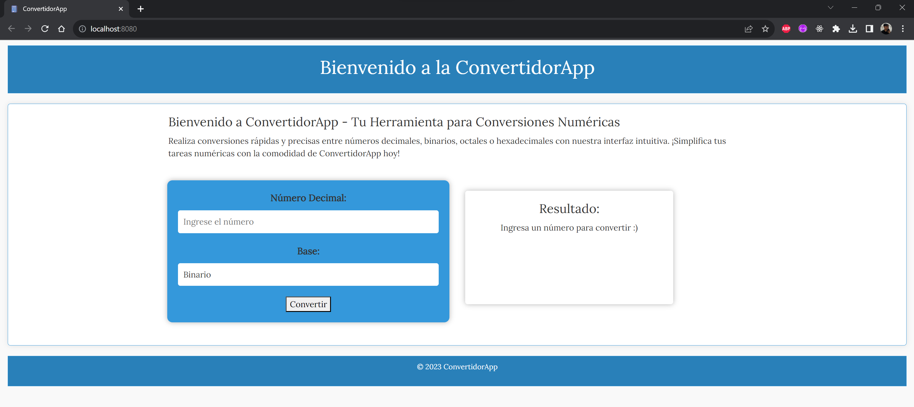

# Aplicación web de Calculadora Convertidora Numérica con Patrones de Diseño

Esta es una aplicación web que convierte números decimales a binarios, octales y hexadecimales.

Fue creada utilizando patrones de diseño como el método de plantilla, control de acceso de proxy y estrategia.

[Inglés](./README.md) | [Español](./README.es.md) | [Francés](./README.fr.md) | [日本語](./README.jp.md)

## Características

- **Convierte números decimales a binarios, octales y hexadecimales.**

## Estructura del Proyecto

El proyecto está estructurado siguiendo el patrón MVC:

- **Modelo:** Contiene interacciones con la base de datos, lógica de negocio y modelos de datos.

- **Vista:** Incluye la capa de presentación responsable de renderizar HTML e interfaces de usuario.

- **Controlador:** Gestiona la lógica central de la aplicación, maneja las solicitudes y orquesta el flujo de datos.

- **Public:** Almacena activos públicos como CSS, JavaScript e imágenes.

## Instalación

1. Clona este repositorio en el directorio de tu servidor web:

    ```bash
    https://github.com/LeoMogiano/convertidor-num.git
    ```

2. Ejecuta el servidor y abre la aplicación en tu navegador.

    ```bash
    php -S localhost:8080 -t public
    ```

## Capturas de Pantalla

*Tablero*

<p align="center">
  
</p>

*Diagrama Dinámico*

<p align="center">
    
</p>

## Contribución

¡Las contribuciones son bienvenidas! Si deseas contribuir a este proyecto, bifurca el repositorio, realiza tus cambios y envía una solicitud de extracción.

## Licencia

Este proyecto es de código abierto y está disponible bajo la [Licencia MIT](LICENSE). Eres libre de usarlo y modificarlo según tus necesidades de administración eclesiástica.

## Contacto

Si tienes alguna pregunta o necesitas asistencia, no dudes en contactarnos.

¡Disfruta usando la aplicación!
