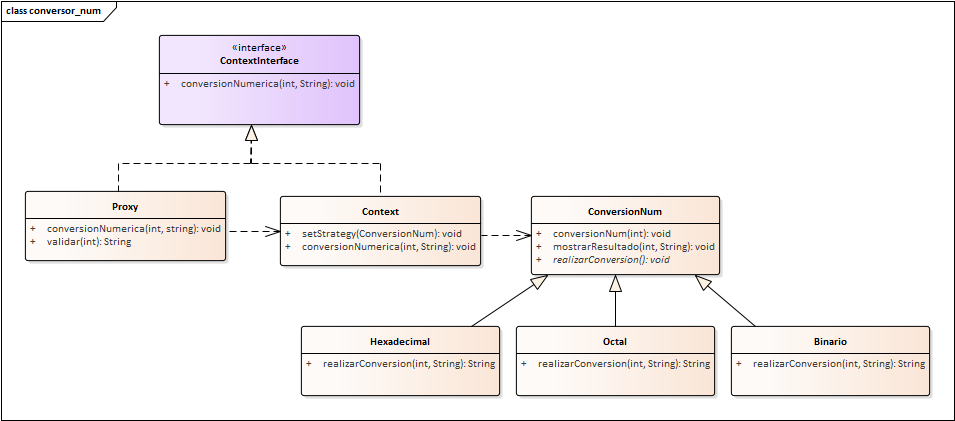

# Application Web de Calculatrice de Conversion Numérique avec Modèles de Conception

Il s'agit d'une application web qui convertit les nombres décimaux en nombres binaires, octaux et hexadécimaux.

Elle a été réalisée avec des modèles de conception tels que la méthode de modèle, le contrôle d'accès par proxy et la stratégie.

[English](./README.md) | [Español](./README.es.md) | [Français](./README.fr.md) | [日本語](./README.jp.md)

## Fonctionnalités

- **Convertit les nombres décimaux en nombres binaires, octaux et hexadécimaux.**

## Structure du Projet

Le projet est structuré selon le modèle MVC :

- **Modèle :** Contient les interactions avec la base de données, la logique métier et les modèles de données.

- **Vue :** Inclut la couche de présentation responsable du rendu HTML et des interfaces utilisateur.

- **Contrôleur :** Gère la logique centrale de l'application, traite les demandes et orchestre le flux de données.

- **Public :** Stocke les ressources publiques telles que le CSS, le JavaScript et les images.

## Installation

1. Clonez ce dépôt dans le répertoire de votre serveur web :

    ```bash
    https://github.com/LeoMogiano/convertidor-num.git
    ```

2. Lancez le serveur et ouvrez l'application dans votre navigateur.

    ```bash
    php -S localhost:8080 -t public
    ```

## Captures d'écran

*Tableau de Bord*

<p align="center">
  
</p>

*Diagramme Dynamique*

<p align="center">
    
</p>

## Contribution

Les contributions sont les bienvenues ! Si vous souhaitez contribuer à ce projet, veuillez forker le dépôt, apporter vos modifications et soumettre une demande de fusion.

## Licence

Ce projet est open source et disponible sous la [Licence MIT](LICENSE). Vous êtes libre de l'utiliser et de le modifier pour vos besoins d'administration ecclésiastique.

## Contact

Si vous avez des questions ou avez besoin d'aide, n'hésitez pas à nous contacter.

Profitez de l'utilisation de l'application !
