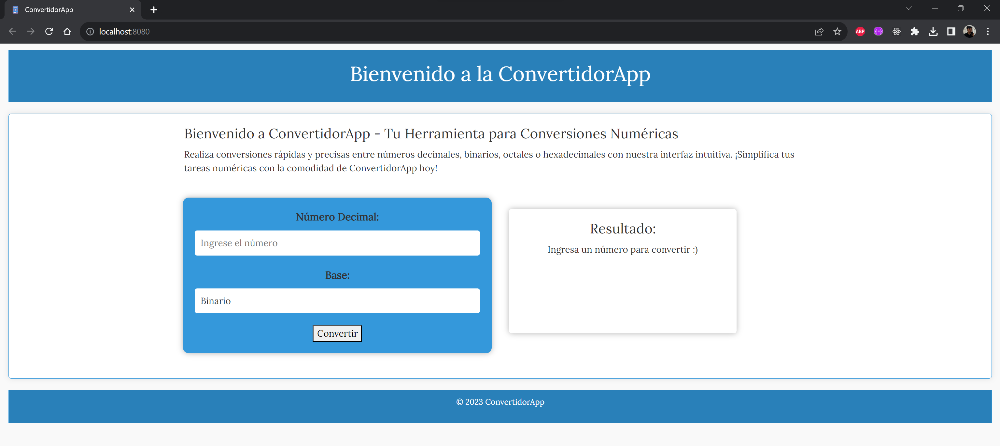
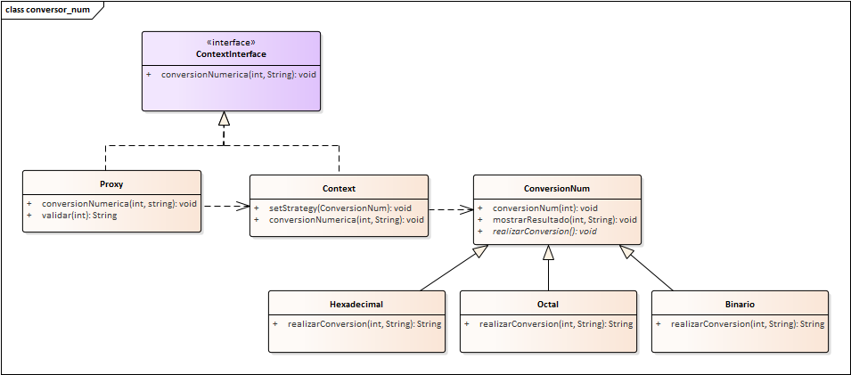

# Numeric Converter Calculator Web Application with Design Patterns 

This is a web application that converts decimal numbers to binary, octal and hexadecimal numbers.

It was made with design patterns which are template method, proxy control-access and strategy.

[English](./README.md) | [Español](./README.es.md) | [Français](./README.fr.md) | [日本語](./README.jp.md)

## Features

- **Convert decimal numbers to binary, octal and hexadecimal numbers.**

## Project Structure

The project is structured following the MVC pattern:

- **Model:** Contains database interactions, business logic, and data models.

- **View:** Includes the presentation layer responsible for rendering HTML and user interfaces.

- **Controller:** Manages the application's core logic, handling requests, and orchestrating data flow.

- **Public:** Store public assets like CSS, JavaScript, and images.

## Installation

1. Clone this repository to your web server directory:

    ```bash
    https://github.com/LeoMogiano/convertidor-num.git
    ```

2. Run server and open the application in your browser.

    ```bash
    php -S localhost:8080 -t public
    ```

## Screenshots

*Dashboard*

<p align="center">
  
</p>

*Dynamic Diagram*

<p align="center">
    
</p>

## Contribution

Contributions are welcome! If you'd like to contribute to this project, please fork the repository, make your changes, and submit a pull request.

## License

This project is open-source and available under the [MIT License](LICENSE). You're free to use and modify it for your church administration needs.

## Contact

If you have any questions or need assistance, feel free to contact us.

Enjoy using the application!
